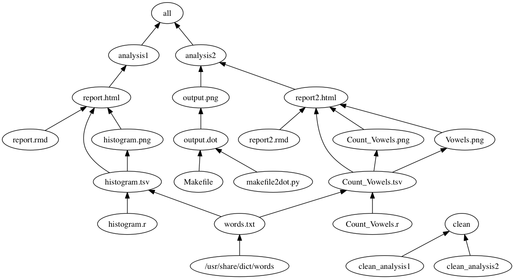

Make-activity
=============

The commit history of this repository reflects what a student might do as she works through [this activity](http://stat545-ubc.github.io/automation04_make-activity.html) from [STAT 545](http://stat545-ubc.github.io). This fully developed example shows:

  * How to run an R script non-interactively
  * How to use `make`
    - to record which files are inputs vs. intermediates vs. outputs
    - to capture how scripts and commands convert inputs to outputs
    - to re-run parts of an analysis that are out-of-date
  * The intersection of R and `make`, i.e. how to
    - run snippets of R code
    - run an entire R script
    - render an R Markdown document (or R script)
  * The interface between RStudio and `make`
  * How to use `make` from the shell
  * How Git facilitates the process of building a pipeline
  
#### My repo is structured as follows:

<table style="width:42%;">
<colgroup>
<col width="23%" />
<col width="18%" />
</colgroup>
<thead>
<tr class="header">
<th><strong>Documents</strong></th>
<th><strong>Description</strong></th>
</tr>
</thead>
<tbody>
<tr class="odd">
<td><a href="https://github.com/STAT545-UBC-students/hw09-funkedavid82/blob/master/README.md">README.md</a></td>
<td>Readme.md file gives a brief description of all I have in the homework9 folder</td>
</tr>
<tr class="even">
<td><a href="https://github.com/STAT545-UBC-students/hw09-funkedavid82/blob/master/Makefile">Makefile</a></td>
<td>The edited makefile </td>
</tr>
<tr class="odd">
<td><a href="https://github.com/STAT545-UBC-students/hw09-funkedavid82/blob/master/Makefile">.Rmd file</a></td>
<td>The added Rmarkdown file </td>
</tr>
<tr class="even">
<td><a href="https://github.com/STAT545-UBC-students/hw09-funkedavid82/blob/master/Makefile">R script file</a></td>
<td>The added R script </td>
</tr>
</tbody>
</table>

# Objectives

The homework aimed at making changes to the make activity pipeline originally [here](https://github.com/STAT545-UBC/make-activity). An `R script` and an `Rmd script` were added to the pipeline by editing the `Makefile`. We generated outputs from both added files. I edited the file in such a way that it is connected to the [original pipeline](https://github.com/STAT545-UBC/make-activity). My Makefile is edited in a way that any change in dependencies will still generate a correct output.
The command `make clean` works and removed all the prior output, while the command `make all` generates a set of new ouput. All unneccessary outputs, e.g Rplots.pdf, were removed from my outputs.

# Added features

## Added more phony targets besides `clean` and `all`.

I made `analysis1` and `analysis2`, and then added `clean_analysis1` and `clean_analysis2`

## R script

I added an R script called `Count_Vowels.R`, designed to count the number of vowels in each English word from the file `words.txt`. For counting, I called the package `stringr` and used the command `str_count()` from this package. The .R file gave a table called `Count_Vowels.tsv` as output. This table has two variables called `Number_of_Vowels` (gives the number of vowels from 0 to 11 in all English words) and `Freq` (gives the total number of words with 0 to 11 vowels). The `Count_Vowels.tsv` is dependent on `word.txt` and therefore added it to the Makefile.

## Rmd file

I added an Rmd file called `report2.Rmd`, designed to generates plots. This .Rmd file takes in `Count_Vowels.tsv` as input and gave two plots as outputs. The two plots from Rmd are: 

1. A histogram, which gave the qplot of the total number of words with 0 to 11 vowels. 

2. A barplot, which gave a barplot of similar information as the histogram but in another form.

I output the most common number of vowels.

## Edited Makefile

I separated my analysis into two: `analysis1` (the original analysis that came with the pipeline) and `analysis2` (my added analysis). I added `report2.html` under analysis2 since it is at the top of the dependency chain. I also added output Count_Vowels.tsv Count_Vowels.png Vowels.png report2.md report2.html output.dot and output.png under `clean_analysis2`, so that they are removed whenever `make clean` command is used. The plots Count_Vowels.png Vowels.png depend on the Count_Vowels.tsv file, and I therefore included these dependencies in Makefile. I output the .Rmd file as .html files and in summary noted files with dependencies and their dependencies in the Makefile.

## Graph of the Makefile pipeline 

To make this pipeline, I needed to install the package `homebrew` for the installed package `graphviz` to run on Mac.

## Credits

The original product that my homework repo was seeded with is [here](https://github.com/STAT545-UBC/make-activity).

# References:

1.  [STAT547 class exercise110 and note](https://github.com/funkedavid82/Stat545_participation/tree/master/cm110)

2.  [Original product](https://github.com/STAT545-UBC/make-activity)
  
3. [makefile2dot](https://github.com/vak/makefile2dot)