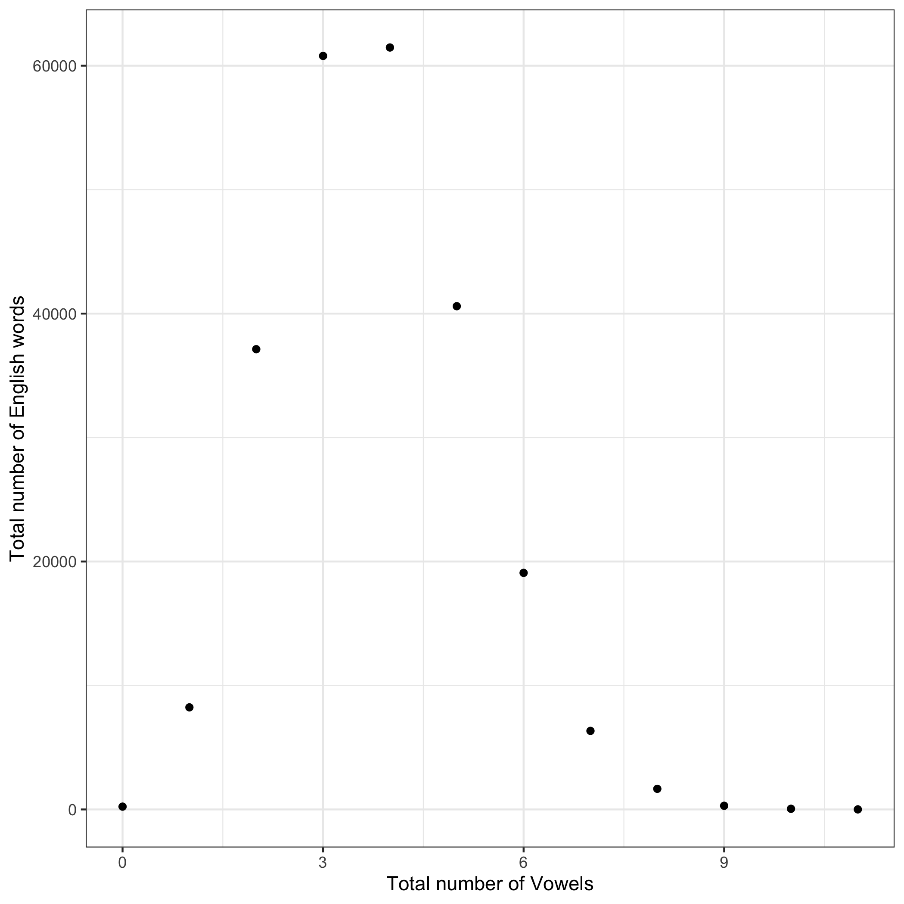

I found the number of words with $1,2,3, \ldots, n$ vowels. I computed the number of vowels in each word, 

i.e. the number of vowel characters, and tabulated how many words consist of 1 vowel, 2 vowels, etc.

```{r load-Data-for-Number-of-Vowels, include = FALSE}
Data_for_Number_of_Vowels <- read.delim("Count_Vowels.tsv")
```

The most frequent number of vowels is `r with(Data_for_Number_of_Vowels, Number_of_Vowels[which.max(Data_for_Number_of_Vowels$Freq)])`.

Here is the histogram of the total number of words with $1,2,3, \ldots, n$ vowels.



Here is a barchart of the total number of English with $1,2,3, \ldots, n$ vowels.


