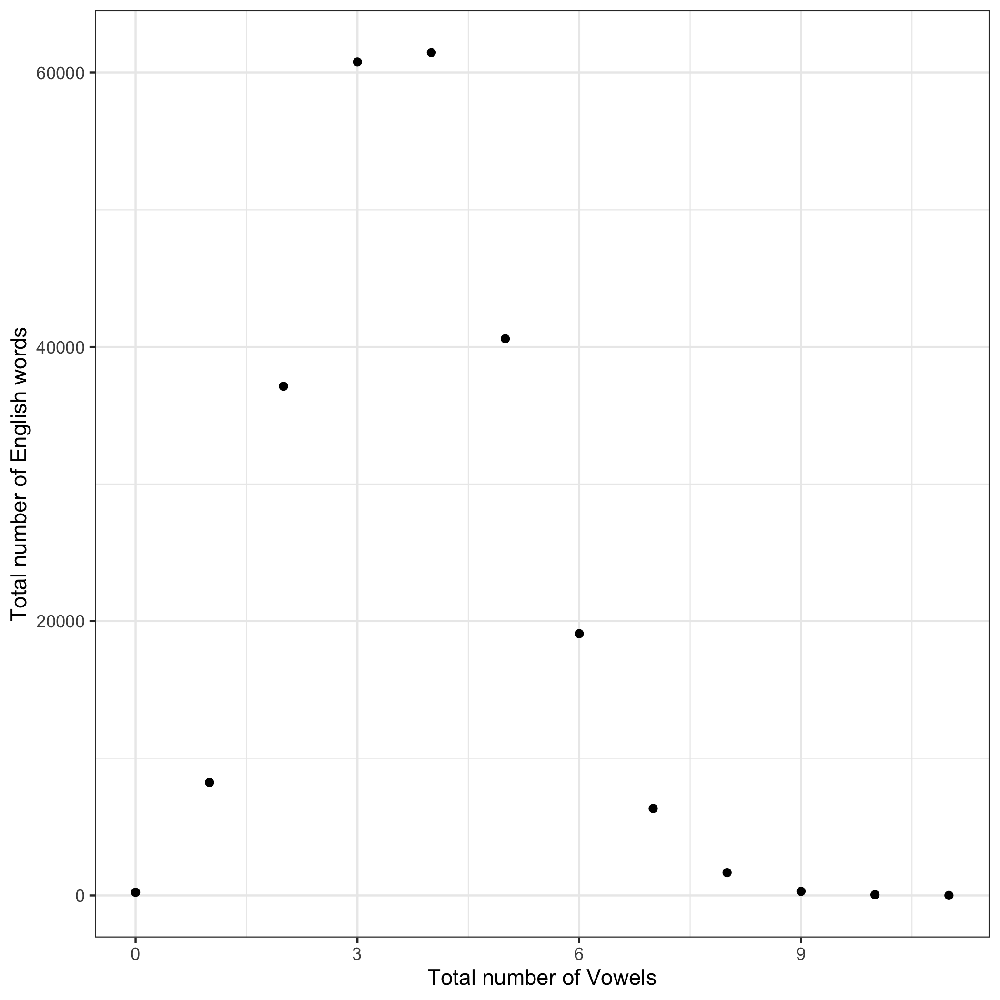
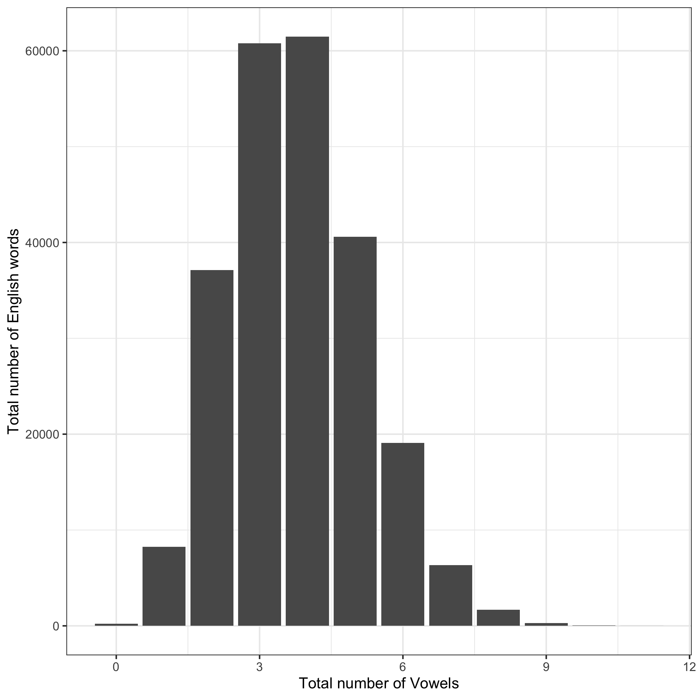

I found the number of words with $1,2,3, \ldots, n$ vowels. I computed the number of vowels in each word, 

i.e. the number of vowel characters, and tabulated how many words consist of 1 vowel, 2 vowels, etc.

The most frequent number of vowels is 4.

Here is the histogram of the total number of words with $1,2,3, \ldots, n$ vowels.

Here is a barchart of the total number of English with $1,2,3, \ldots, n$ vowels.

